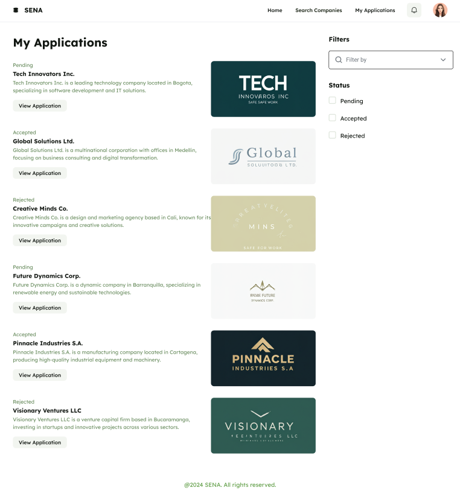
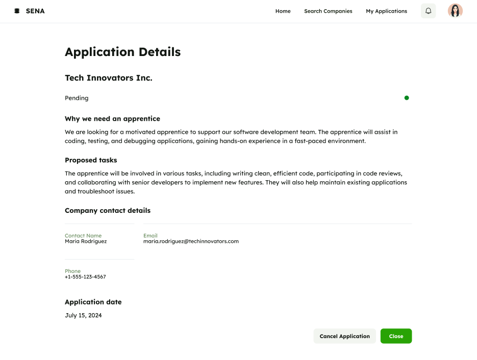
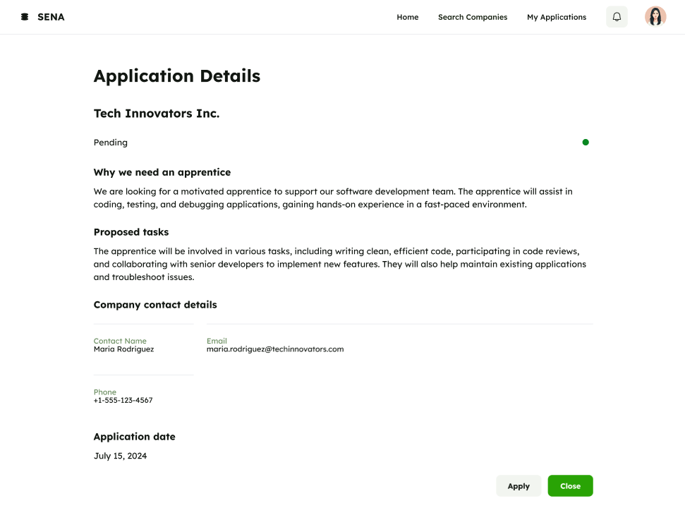
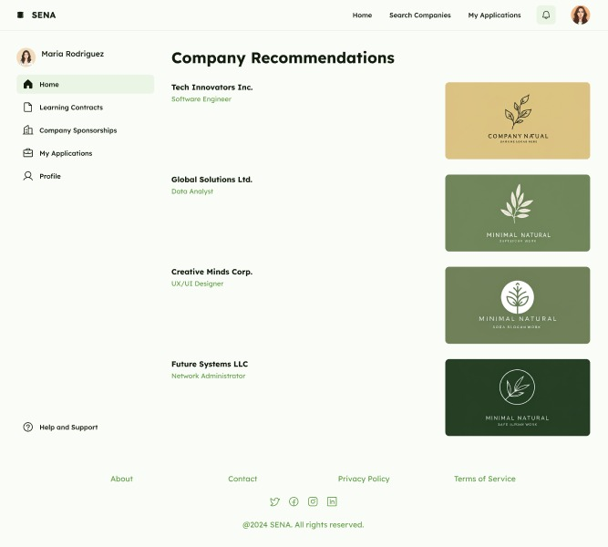

## PRODUCTO:

## SENA Match

### 🔗 La red inteligente que une aprendices con empresas.

Este agente, llamado **SENA Match**, no es simple herramienta, sino compañero fiel del aprendiz.  
Le asiste en la búsqueda de contratos de aprendizaje, interpretando con sabiduría las ofertas confusas, resumiéndolas con claridad, y observando el silencio de las empresas para sugerir nuevas sendas cuando la espera se torna infructuosa.

Habla la lengua de las máquinas, extrae información de las entrañas del **SGVA**, y aconseja con conocimiento nacido de los datos.  
Otorga libertad al aprendiz: para aplicar más de una vez, para elegir con certeza, y para avanzar aunque el sistema lo detenga.

Asimismo, ofrece un **tablero de sabiduría para los mentores**, donde pueden ver qué aprendices han postulado, qué empresas han respondido, y en qué punto se halla cada proceso.  
Así se restablece la armonía entre quien busca, quien guía y quien contrata.

Este Match será creado con técnicas de _prompt_ y _context engineering_, y vivirá en **WhatsApp** o en la **web**, siempre listo para asistir, empoderar y transformar.  
En su versión inicial, se enfocará en explorar ofertas, generar resúmenes y liberar al aprendiz para aplicar sin bloqueo, usando flujos simulados o datos ficticios si no hay acceso oficial al SGVA.

Pues tal es la voluntad de quien se atreve a rehacer el mundo con las herramientas del mañana y el coraje del presente.

## CONTEXTO:

# 📌 Contexto – ¿Por qué nace la idea de SENA Match?

La idea de **SENA Match** nace a partir de la experiencia directa de los aprendices del SENA con la plataforma **SGVA (Sistema de Gestión Virtual de Aprendices)**.  
Aunque el SGVA es la herramienta oficial para gestionar contratos de aprendizaje, presenta múltiples limitaciones que dificultan el proceso de búsqueda de patrocinio:

- La plataforma no es **responsiva**, lo que dificulta su uso en dispositivos móviles, el medio más común entre aprendices.
- Las descripciones de los contratos son **ambiguas**, lo que genera confusión al momento de aplicar.
- En la mayoría de los casos, las **empresas no responden** a las postulaciones, dejando al aprendiz sin claridad sobre su proceso.
- Tras postularse a una oferta, el sistema **bloquea al usuario** para seguir aplicando a otras, limitando sus oportunidades.

Como resultado, muchos aprendices se sienten **estancados, frustrados y desinformados**, lo cual afecta directamente la culminación de su etapa lectiva y el inicio de la etapa productiva.

---

Ante esta situación, surge **SENA Match**: un agente inteligente que busca transformar la experiencia del aprendiz, ofreciendo claridad, acompañamiento y nuevas oportunidades mediante inteligencia artificial.

Su propósito no es reemplazar el SGVA, sino **complementarlo**, demostrando que la IA puede ser una **aliada ética, útil y accesible** para modernizar los procesos de formación en Colombia.

## PROMPTS:

### PROMPT #1

# 🎨 Actúa como:

Un diseñador _UI/UX experto_ en aplicaciones educativas y de gestión de usuarios.

---

## 📌 Tarea

Diseñar la pantalla _“Buscar Empresas”_ para una aplicación web del _SENA_, destinada a aprendices que buscan empresas patrocinadoras o contratos de aprendizaje.

---

## 🎨 Identidad visual

- _Color principal:_ #38a800 (verde institucional SENA)
- _Colores complementarios:_
- Blanco #FFFFFF
- Grises claros/medios #F5F5F5, #B0B0B0
- _Estilo visual:_ Limpio, moderno, profesional, accesible
- _Tipografía:_ Sans-serif moderna (ej. Roboto o Poppins) con tamaños bien jerarquizados

---

## 🧩 Estructura de la página

### 1. Header (cabecera)

- Fondo blanco
- Logo del _SENA_ en la esquina superior derecha

### 2. Zona principal (pantalla dividida en 2 columnas)

_Izquierda (70% ancho):_

- Listado en _tarjetas verticales (cards)_ de empresas con scroll
- Cada card incluye:
- ✅ _Nombre de la empresa:_ título en verde #38a800, tipografía _bold_
- ✅ Breve descripción (qué busca + ciudad)
- ✅ _Nuevo:_ Pequeño _logo de la empresa_ o imagen representativa
- Fondo blanco, sombra ligera, bordes redondeados, márgenes internos amplios
- Texto en gris oscuro
- _Acción:_ al hacer clic → abre un _modal emergente_ con más info

_Derecha (30% ancho):_

- Filtros de ubicación (_checkbox_ por ciudades, desmarcables)
- Barra de búsqueda con _input redondeado_ y borde gris claro

### 3. Modal emergente (al seleccionar empresa)

- Fondo semitransparente gris oscuro (#000 con 70% opacidad)
- Caja central blanca, bordes redondeados _16px_
- Contenido:
- Motivo de búsqueda de aprendiz
- Nombre completo de la empresa (_título en verde_)
- Descripción de tareas detalladas
- Datos de contacto (_correo + teléfono_)
- Botón destacado _"Enviar Solicitud"_
- Fondo verde #38a800
- Texto blanco
- Bordes redondeados
- Hover: sombra suave

### 4. Footer

- Fondo gris muy claro
- Texto pequeño en gris oscuro:
- © SENA - Todos los derechos reservados

---

## 🔧 Estilo de componentes

- _Botones:_ Rectangulares, bordes redondeados, verde #38a800, texto blanco, hover con sombra ligera
- _Inputs & filtros:_ Campos con bordes gris claro, esquinas redondeadas, texto gris oscuro
- _Tarjetas de empresa:_ Fondo blanco, sombra ligera, bordes suaves, márgenes internos amplios, tipografía moderna (Roboto/Poppins), títulos en *bold, descripciones en *regular
- _Nuevo detalle:_ Incluir _logo o imagen pequeña de la empresa_ en cada tarjeta

---

## 👉 Output esperado

Una _descripción visual clara_ de la pantalla con todos los elementos aplicados:

- ✅ Paleta de colores
- ✅ Distribución en dos columnas (empresas y filtros)
- ✅ Ejemplo visual de una tarjeta (con logo)
- ✅ Ejemplo visual del modal emergente
- ✅ Estilos aplicados a botones, inputs y tipografía

## 📷 Imagen Generada


---

### PROMPT #2

# 🎨 Actúa como  
Un diseñador *UI/UX experto* en aplicaciones educativas y de gestión de usuarios.  

---

## 📌 Tarea  
Diseñar la pantalla *“Mis Solicitudes”* de una aplicación web del *SENA*, destinada a aprendices que buscan empresas patrocinadoras o contratos de aprendizaje.  

Esta pantalla mostrará *todas las solicitudes enviadas* por el aprendiz a diferentes empresas, con su estado actual.  

---

## 🎨 Identidad visual  
(igual que en la pantalla “Buscar Empresas”)  
- *Color principal:* #38a800 (verde institucional SENA)  
- *Colores complementarios:*  
- Blanco #FFFFFF  
- Grises claros/medios #F5F5F5, #B0B0B0  
- *Estilo visual:* Limpio, moderno, profesional, accesible  
- *Tipografía:* Sans-serif moderna (Roboto o Poppins) con jerarquía clara  

---

## 🧩 Estructura de la página  

### 1. Header (cabecera)  
- Fondo blanco  
- Logo del *SENA* en la esquina superior derecha  
- Título o breadcrumb: *“Mis Solicitudes”*  

---

### 2. Zona principal (pantalla dividida en 2 columnas)  

*Izquierda (70% ancho):*  
- Listado en *tarjetas (cards)* con scroll vertical  
- Cada tarjeta representa una solicitud enviada e incluye:  
- ✅ Nombre de la empresa (**título en verde #38a800**, bold)  
- ✅ Breve descripción de la empresa y ubicación  
- ✅ *Estado de la solicitud* (con *badge* de color):  
- ✅ Fecha de aplicación  
- Fondo blanco, sombra ligera, bordes redondeados, márgenes internos amplios  
- Texto en gris oscuro  
- *Acción:* al hacer clic → abre un *modal emergente* con más información  

*Derecha (30% ancho):*  
- Filtros para organizar las solicitudes:  
- Por *estado* (checkbox o toggle: Pendiente, Aceptada, Rechazada)  
- Barra de búsqueda para encontrar solicitudes por *nombre de empresa*  

---

### 3. Modal emergente (al seleccionar una solicitud)  
- Fondo semitransparente gris oscuro (#000 con 70% opacidad)  
- Caja central blanca, bordes redondeados *16px*  
- Contenido:  
- Nombre de la empresa (*título en verde*)  
- Estado de la solicitud (*badge de color*)  
- Motivo de búsqueda de aprendiz  
- Descripción de las tareas propuestas  
- Datos de contacto de la empresa  
- Fecha en que se envió la solicitud  
- *Botones de acción:*  
- "Cancelar Solicitud" (si el estado es *Pendiente*)  
- "Cerrar" (para salir del modal)  

---

### 4. Footer  
- Fondo gris muy claro  
- Texto pequeño en gris oscuro:  
- © SENA - Todos los derechos reservados  

---

## 🔧 Estilo de componentes  
- *Botones:* Rectangulares, bordes redondeados, verde #38a800, texto blanco, hover con sombra ligera  
- *Inputs & filtros:* Bordes gris claro, esquinas redondeadas, texto gris oscuro  
- *Tarjetas de solicitudes:* Fondo blanco, sombra ligera, bordes suaves, badges de colores según estado  
- *Tipografía:* Sans-serif moderna (Roboto/Poppins), títulos en *bold, descripciones en *regular  

---

## 👉 Output esperado  
Una *descripción visual clara* de la pantalla con todos los elementos aplicados:  
- ✅ Paleta de colores aplicada  
- ✅ Distribución en dos columnas (solicitudes y filtros)  
- ✅ Ejemplo visual de una tarjeta con estados (Pendiente, Aceptada, Rechazada)  
- ✅ Ejemplo visual del modal emergente con botones de acción  
- ✅ Estilos aplicados a botones, inputs y tipografía

## 📷 Imagen Generada



---

### PROMPT #3

# 🎨 Actúa como  
Un diseñador *UI/UX experto* en aplicaciones educativas y de gestión de usuarios.  

---

## 📌 Tarea  
Diseñar un *modal (ventana emergente)* para la aplicación web del *SENA*, que muestre en detalle la información de una solicitud enviada por el aprendiz a una empresa.  

El modal debe mantener la *identidad visual institucional* y presentar los datos de manera clara, estructurada y fácil de leer.  

---

## 🎨 Identidad visual  
- *Color principal:* #38a800 (verde institucional SENA)  
- *Colores complementarios:* Blanco #FFFFFF, grises claros/medios #F5F5F5, #B0B0B0  
- *Tipografía:* Sans-serif moderna (Roboto o Poppins)  
- *Estilo visual:* Minimalista, moderno, accesible, profesional  

---

## 🧩 Estructura del modal  

### Fondo  
- Overlay gris oscuro semitransparente (#000 con 70% opacidad)  

### Caja central  
- Fondo blanco  
- Bordes redondeados *16px*  
- Centrada en pantalla  
- Sombra ligera  

### Contenido  

1. *Encabezado*  
- Título: Application Details (en *bold*)  
- Nombre de la empresa (verde #38a800, bold)  
- Estado de la solicitud (badge de color según estado)  

2. *Secciones de información*  
- *Why we need an apprentice* → Texto descriptivo  
- *Proposed tasks* → Texto descriptivo  
- *Company contact details* → Nombre, email y teléfono del contacto  
- *Application date* → Fecha de envío de la solicitud  

3. *Footer del modal (acciones)*  
- Botón *“Cancel Application”* (si el estado es Pending)  
- Estilo: fondo gris claro #F5F5F5, texto oscuro, hover con sombra ligera  
- Botón *“Close”*  
- Estilo: fondo verde #38a800, texto blanco, bordes redondeados  

---

## 🔧 Estilo de componentes  
- *Botones:* Modernos, con bordes redondeados, hover con sombra  
- *Badges de estado:*  
- *Textos:*  
- Títulos en *bold*  
- Secciones con subtítulos claros  
- Texto de apoyo en gris oscuro  

---

## 👉 Output esperado  
Una *ventana modal clara y visualmente consistente*, que muestre:  
- ✅ Título y nombre de la empresa  
- ✅ Estado de la solicitud con badge de color  
- ✅ Secciones informativas (necesidad, tareas, contacto, fecha)  
- ✅ Botones de acción bien diferenciados (Cancelar y Cerrar)  
- ✅ Estilo visual alineado con la identidad del SENA

## 📷 Imagen Generada



# 🎨 Actúa como  
Un diseñador *UI/UX experto* en interfaces educativas y de gestión de usuarios.  

---

## 📌 Tarea  
Generar una **imagen de un modal (ventana emergente)** para la aplicación web del *SENA*, mostrando los detalles de una solicitud enviada por el aprendiz a una empresa.  

---

## 🎨 Identidad visual  
- *Color principal:* `#38a800` (verde institucional SENA)  
- *Colores complementarios:* Blanco `#FFFFFF`, grises claros/medios `#F5F5F5`, `#B0B0B0`  
- *Tipografía:* Sans-serif moderna (Roboto o Poppins)  
- *Estilo visual:* Minimalista, moderno, accesible, profesional  

---

## 🧩 Estructura del modal (en la imagen)  

### Fondo  
- Overlay gris oscuro semitransparente (`rgba(0,0,0,0.7)`)  

### Caja central  
- Fondo blanco  
- Bordes redondeados `16px`  
- Centrada en pantalla  
- Sombra ligera  

### Contenido  

1. **Encabezado**  
   - Título: **Application Details** (negrita, grande)  
   - Nombre de la empresa: **Tech Innovators Inc.** en verde `#38a800`, bold  
   - Estado de la solicitud en **badge** (ejemplo: *Pending* en gris `#B0B0B0`)  

2. **Secciones de información**  
   - **Why we need an apprentice** → Texto descriptivo breve  
   - **Proposed tasks** → Texto descriptivo breve  
   - **Company contact details** → Nombre, email y teléfono del contacto  
   - **Application date** → Fecha de envío  

3. **Footer del modal (acciones)**  
   - Botón **Apply**  
     - Estilo: fondo verde `#38a800`, texto blanco, bordes redondeados, hover con sombra  
   - Botón **Close**  
     - Estilo: fondo gris claro `#F5F5F5`, texto oscuro, hover con sombra ligera  

---

## 🔧 Estilo de componentes  
- Botones modernos con bordes redondeados  
- Badges diferenciados por color (gris, verde, rojo)  
- Títulos en **bold**, subtítulos claros, texto secundario en gris oscuro  

---

## 👉 Output esperado  
Una **imagen realista de un modal moderno y minimalista**, con:  
- ✅ Fondo oscuro con overlay  
- ✅ Caja blanca centrada con bordes redondeados  
- ✅ Título, empresa y badge de estado  
- ✅ Secciones con subtítulos claros  
- ✅ Footer con botones diferenciados (**Apply** y **Close**)  
- ✅ Estilo alineado con la identidad del SENA  

## 📷 Imagen Generada



# 🙋‍♂️ Realizado Por:

Nicolas Manzano Muriel

### PROMPT #4

# 🖥️ Pantalla de Inicio – Aplicación Web SENA Match

Actúo como experto en **UI/UX** especializado en aplicaciones educativas y de gestión de aprendices.  
El diseño propuesto sigue un estilo **minimalista, moderno y accesible**, coherente con la paleta y lineamientos visuales previamente definidos.

---

## 📂 Menú lateral (Sidebar)
- **Ubicación:** lado izquierdo de la pantalla.  
- **Estilo:** fondo blanco con detalles en `#38a800`.  
- **Interacción:** desplegable, con un icono tipo "hamburguesa" (`☰`) que al presionar abre o cierra el menú.  
- **Opciones de navegación:**  
  - Inicio  
  - Buscar empresas  
  - Consultar mis aplicaciones  

👉 Cuando esté **colapsado**, se mostrarán solo iconos; cuando esté **expandido**, se mostrarán iconos + texto.

---

## 🏢 Cuerpo principal (Home)

### 🎴 Tarjetas de recomendaciones de empresas
- **Diseño de tarjetas:**  
  - Bordes redondeados (`border-radius: 12px`).  
  - Fondo blanco con sombra ligera para resaltar.  
  - Margen amplio entre tarjetas para mantener aire visual.  
  - Hover: resaltar borde en `#38a800` con transición suave.  

### 📌 Contenido de cada tarjeta
- **Nombre de la empresa** → en etiqueta `<h3>` con tipografía semibold.  
  Ejemplo:  
  ```html
  <h3>Empresa XYZ</h3>



# 🙋‍♂️ Realizado Por:

Jhoan David Sinisterra Valencia


### PROMPT #5

# 📝 Instrucciones de diseño

## 🔐 Pantallas de inicio de sesión
- Crear **dos pantallas de login**:
  - 👩‍🎓 Una destinada a **aprendices**.  
  - 🏢 Otra destinada a **empresas**.  
- El diseño debe ser **sencillo, minimalista y accesible**.  
- Cada pantalla debe solicitar únicamente los siguientes campos:  
  - 👤 **Usuario**  
  - 🔑 **Contraseña**  
- Los campos deben estar **alineados a la izquierda** y cubrir **toda la zona izquierda de la página**.  

---

## 🎨 Paleta de colores
- **Principal:** 🟢 `#39a800`  
- **Complementarios:** ⚪ Tonalidades de **blanco** y **gris**.  

---

## ✨ Estilo visual
- 🧼 Limpio  
- 💻 Moderno  
- 🏆 Profesional  
- Enfocado en **claridad, legibilidad y accesibilidad**.  

---

## 🔤 Tipografía
- Usar **Work Sans** en todos los textos.  

---

## 📐 Estructura de la página
- **Cuerpo:**  
  - 📋 Contenedor principal con formulario de login.  
- **Pie de página (footer):**  
  - Estilo sencillo con la paleta definida.  
  - Debe contener:  
    - 📞 Información de contacto de la empresa desarrolladora.  
    - 📧 Correos de soporte.  
    - 🏠 Dirección física.  
    - 🌐 Enlaces a redes sociales.  

---

## 🖼️ Imagen
- Añadir una **imagen con estilo al óleo de estudiantes en sus pupitres**.  
- Debe cubrir **toda la zona derecha de la web**.  


# 🙋‍♂️ Realizado Por:

Jefferson Andres Roa Carrillo

